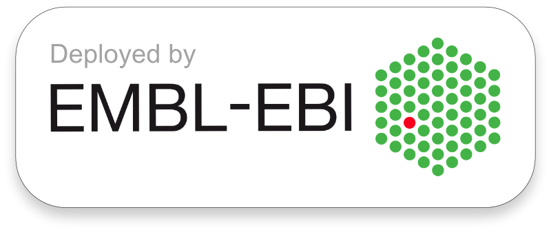

# Interactive MOFA+

MOFA+ models made interactive with Shiny by RStudio.

See [more on MOFA+ here](https://github.com/biofam/MOFA2/). See [more on Shiny apps here](http://shiny.rstudio.com/tutorial/).image link

[](http://www.ebi.ac.uk/shiny/mofa/)

## Getting started

To run the app, you can clone the repository and start the Shiny app directly from the terminal:

```
git clone https://github.com/gtca/mofaplus-shiny
R -e "shiny::runApp('mofaplus-shiny/app')"
```

MOFA+ shiny app can also be run from a Docker container:

You can pull an image from DockerHub

```
docker pull gtca/mofa2shiny:latest
```

or build it yourself:

```
docker build -t mofa2shiny .
```

To start the shiny app from the container, run

```
docker run -ti -p 3838:3838 --rm mofa2shiny 
```

and open a tab with the respective host port address in your web browser (e.g. [localhost:3838](http://127.0.0.1:3838/)).

